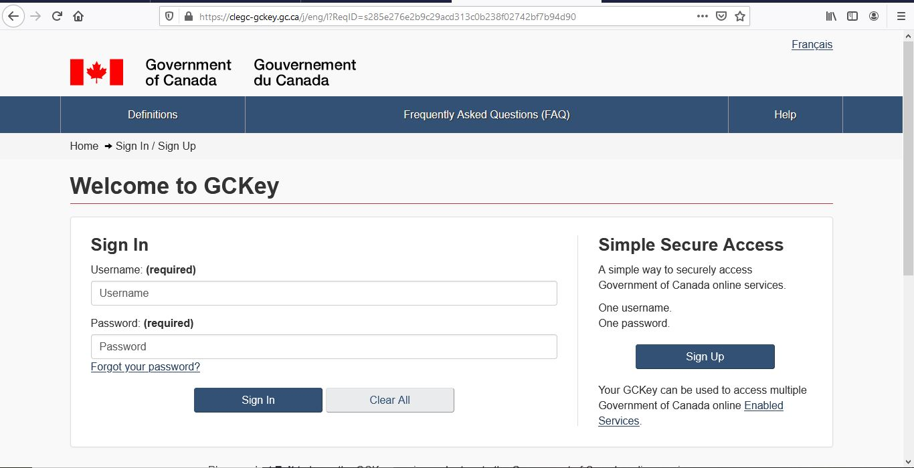
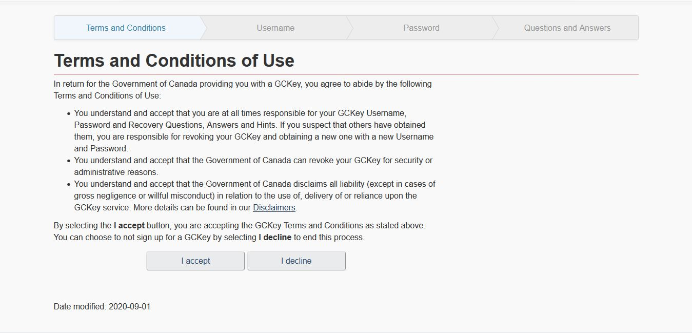

# Canada Study Visa Process
## **Brief Introduction**
HI! planning to study in canada as an internationl student, This is the right place for you to fulfill your dreams. Here at my page you will get all relevent information pretaining to how you can apply for the study permit application and what all documents are required to apply for study permit application.
### **What is a study permit?**
The study permit is a document we issue that allows foreign nationals to study at designated learning institutions (DLI) in Canada. Most foreign nationals need a study permit to study in Canada. Make sure you have all the documents you need before you apply. You should apply before you travel to Canada. Student can apply for the study permit application either in Student Direct Stream (SDS) category or Non Student Direct Stream (NON SDS) Category.  
### **How long can you stay in Canada with a study permit?**
A study permit is usually valid for the length of your study program, plus an extra 90 days. The 90 days let you prepare to leave Canada or apply to extend your stay.
### **Who are eligible to apply for the study permit application?**
1. Meet the eligibility criteria of Designated Learning Institute (DLI).
2. Having valid IELTS band scores.
3. Have the ability to pay for the Tuition fee and Living expenses.
 ### **What is Student Direct Stream (SDS)?**
 It is a criteria defined by the Canadian High Commission for the study permit application. If a student fulfill the following criteria then he/she is eligible to apply his/her application under SDS category:
 1. Student must have a valid Offer letter from DLI.
 2. Must have paid the tuition fee of one year as specified in the offer letter.
 3. Must have Guaranteed Investment Certificate from Canadian Bank amounting to $10000 CAD.
 4. Must have Minimum 6.0 Bands in each module of IELTS.
 - ***Note:** Student failing to comply with any of the above criteria will be considered as a NON SDS cateory applicant.*
## **Documents required to apply for Study Permit Application**
- ### **For Student Direct Stream (SDS) Category:**
1. Study Permit Application Form ([IMM 1294](https://www.canada.ca/content/dam/ircc/migration/ircc/english/pdf/kits/forms/imm1294e.pdf))
2. Family Information Form ([IMM 5707](https://www.canada.ca/content/dam/ircc/migration/ircc/english/pdf/kits/forms/imm5707e.pdf))
3. Valid IELTS TRF
4. Valid Passport
5. Medical Examination Certificate from panel Physician [Click Here to find the list of panel physicians](https://secure.cic.gc.ca/pp-md/pp-list.aspx)
6. A valid letter of acceptance from the Designated Learning Institute (DLI).
7. First year fee payment receipt from Designated Learning Institute (DLI).
8. Guaranteed Investment Certificate (GIC) amounting to $10000 CAD from Canadian Bank.
9. A Statement of Purpose stating the brief details about the basic purpose of your travel/study to Canada
10. Academic documents incuding marksheets, diploma, degree certificates starting from matric (10th Standard) Onwards.
11. Experience Certificate *(if applicable)*
12. Financial Documents including Income Tax Returns (ITRs), J-Forms (In case of agriculture), Income Certificate, Bank Statements, Salary Slips etc.
13. A Valid Certificat d’acceptation du Québec (CAQ) [Click Here to apply](https://www.immigration-quebec.gouv.qc.ca/en/electronic-services/caq-electronic/index.html) *(if applying for Quebec)*
14. Marriage Certificate along with Marriage Photographs *(if Married)*
- ### **For NON Student Direct Stream (NON SDS) Category:**
1. Study Permit Application Form ([IMM 1294](https://www.canada.ca/content/dam/ircc/migration/ircc/english/pdf/kits/forms/imm1294e.pdf))
2. Family Information Form ([IMM 5707](https://www.canada.ca/content/dam/ircc/migration/ircc/english/pdf/kits/forms/imm5707e.pdf))
3. Valid IELTS TRF
4. Valid Passport
5. Medical Examination Certificate from panel Physician [Click Here to find the list of panel physicians](https://secure.cic.gc.ca/pp-md/pp-list.aspx) 
6. A valid letter of acceptance from the Designated Learning Institute (DLI).
7. Fee payment receipt from Designated Learning Institute (DLI).
8. Guaranteed Investment Certificate (GIC) amounting to $10000 CAD from Canadian Bank.
9. A Statement of Purpose stating the brief details about the basic purpose of your travel/study to Canada
10. Academic documents incuding marksheets, diploma, degree certificates starting from matric (10th Standard) Onwards.
11. Experience Certificate *(if applicable)*
12. Financial Documents including Income Tax Returns (ITRs), J-Forms (In case of agriculture), Income Certificate, Bank Statements, Salary Slips, **CA Report** etc.
13. A Valid Certificat d’acceptation du Québec (CAQ) [Click Here to apply](https://www.immigration-quebec.gouv.qc.ca/en/electronic-services/caq-electronic/index.html) *(if applying for Quebec)*
14. Marriage Certificate along with Marriage Photographs *(if Married)*
## **How to Apply**
After arranging all the documents as stated above you are all set to submit your study permit application online. Here is the step by step guide on how you need to submit your application to the High Commission.
1. Create an Account by [Clicking Here](https://clegc-gckey.gc.ca/j/eng/l?ReqID=s285e276e2b9c29acd313c0b238f02742bf7b94d90). The following screen will appear:

2. Click on the Signup Button. The following screen will appear:

accept the terms and create new User Id and password and answer the questions as asked by them.

3. After answering the few questions you will see a page asking the uplodeof documents will appears. then uplode the documents at the designated palce and pay the required amount of application fee and biometrics.
4. Required amount of application fee and biometric:

| S.No      | Type of Application | Application Fee | Biometric Charges |
| :-----------: | :-----------: | :-----------: | :-----------: |
| 1     | Study Permit     | $150 CAD | $85 CAD |

5. Pay the Requisit amount by using your Visa Credit Card and your application is submitted for processing.